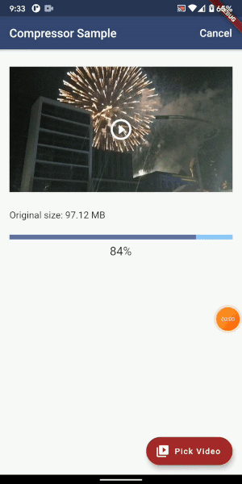

<p align="left">
<a href="https://pub.dev/packages/light_compressor"></a>
</p>


# light_compressor
A powerful and easy-to-use video compression plugin for Flutter built based on [LightCompressor](https://github.com/AbedElazizShe/LightCompressor/tree/master/lightcompressor) library for Android and [LightCompressor_iOS](https://github.com/AbedElazizShe/LightCompressor_iOS) library for iOS and macOS. This plugin generates a compressed MP4 video with a modified width, height, and bitrate.

The general idea of how the library works is that, extreme high bitrate is reduced while maintaining a good video quality resulting in a smaller size.

## How it works
When the video file is called to be compressed, the library checks if the user wants to set a min bitrate to avoid compressing low resolution videos. This becomes handy if you don’t want the video to be compressed every time it is to be processed to avoid having very bad quality after multiple rounds of compression. The minimum bitrate set is 2mbps.

You can pass one of a 5 video qualities; `very_high`, `high`, `medium`, `low` OR `very_low` and the plugin will handle generating the right bitrate value for the output video.

## Demo



## Installation

First, add `light_compressor` as a [dependency in your pubspec.yaml file](https://flutter.io/platform-plugins/).

### iOS and macOS

Add the following to your _Info.plist_ file, located in `<project root>/ios/Runner/Info.plist`:

```
<key>NSPhotoLibraryUsageDescription</key>
<string>${PRODUCT_NAME} library Usage</string>
```

### Android

Add the following permissions in AndroidManifest.xml:

**API < 29**

```xml
<uses-permission android:name="android.permission.READ_EXTERNAL_STORAGE"/>
<uses-permission
    android:name="android.permission.WRITE_EXTERNAL_STORAGE"
    android:maxSdkVersion="28"
    tools:ignore="ScopedStorage" />
```

**API >= 29**

```xml
    <uses-permission android:name="android.permission.READ_EXTERNAL_STORAGE"
    android:maxSdkVersion="32"/>
```

**API >= 33**

```xml
 <uses-permission android:name="android.permission.READ_MEDIA_VIDEO"/>
```

Include this in your Project-level build.gradle file:
```groovy
allprojects {
    repositories {
        .
        .
        .
        maven { url 'https://jitpack.io' }
    }
}
```

Include this in your Module-level build.gradle file:

```groovy
implementation 'com.github.AbedElazizShe:LightCompressor:1.3.2'
```

And since the library depends on Kotlin version `1.8.21`, please ensure that `1.8.21` is the minimum kotlin version in your project by changing `ext.kotlin_version` in your Project-level build.gradle file.

## Usage

In order to start compression, just call [LightCompressor().compressVideo()] and pass the following parameters;
1) `path`: the path of the provided video file to be compressed - **required**.
2) `videoQuality`: to allow choosing a video quality that can be `VideoQuality.very_low`, `VideoQuality.low`, `VideoQuality.medium`, `VideoQuality.high`, or `VideoQuality.very_high` - **required**.
3) `isMinBitrateCheckEnabled`: to determine if the checking for a minimum bitrate threshold before compression is enabled or not. The default value is `true` - **optional**.
4) `android`: which contains configurations specific to Android. These configs are: - **required**
   1) saveAt: The location where the video should be saved externally. This value will be ignored if isSharedStorage is `false`.
   2) isSharedStorage: Whether to save the output video in Android's Shared or App-Specific storage. Refer to this https://developer.android.com/training/data-storage.
5) `ios`: which contains configurations specific to iOS and macOS; - **required**
   1) saveInGallery: To decide saving the video in gallery or not. This defaults to `true`.
6) `video`: contains configurations of the output video:
   1) videoName: The name of the output video file. - **required**
   2) keepOriginalResolution: to keep the original video height and width when compressing.
   3) videoBitrateInMbps: a custom bitrate for the video.
   4) videoHeight: a custom height for the video.
   5) videoWidth: a custom width for the video.
7) `disableAudio`: to give the option to generate a video with no audio. This defaults to `false`.

```dart
import 'package:light_compressor/light_compressor.dart';


final LightCompressor _lightCompressor = LightCompressor();
final Result response = await _lightCompressor.compressVideo(
  path: _sourcePath,
  destinationPath: _destinationPath,
  videoQuality: VideoQuality.medium,
  isMinBitrateCheckEnabled: false,
  video: Video(videoName: videoName),
  android: AndroidConfig(isSharedStorage: true, saveAt: SaveAt.Movies),
  ios: IOSConfig(saveInGallery: true),);
```

The plugin allows cancelling the compression by calling;

```dart
_lightCompressor.cancelCompression();
```

Result response can be one of the following;
- **onSuccess**: if the compression succeeded and it returns the output path if needed.
- **onFailure**: if the compression failed in which a failure message is returned.
- **onCancelled**: if `cancelCompression()` was called.

```dart
   if (response is OnSuccess) {
      final String outputFile = response.destinationPath;
      // use the file

    } else if (response is OnFailure) {
      // failure message
      print(response.message);

    } else if (response is OnCancelled) {
      print(response.isCancelled);
    }
```

In order to get the progress of compression while the video is being compressed the following to receive a stream;

```dart
_lightCompressor.onProgressUpdated
```

You can use a stream builder for example as follows;

```dart
StreamBuilder<double>(
    stream: _lightCompressor.onProgressUpdated,
    builder: (BuildContext context,  AsyncSnapshot<dynamic> snapshot) {
       if (snapshot.data != null && snapshot.data > 0) {
         // --> use snapshot.data
       }
    },
),
```

For more information on how to use the plugin, refer to the [sample app](https://github.com/AbedElazizShe/light_compressor/blob/master/example/lib/main.dart)

## Reporting issues
To report an issue, please specify the following:
- Device name
- Android version
- If the bug/issue exists on the sample app of the library that could be downloaded at this [link](https://drive.google.com/file/d/1bI-0Mny2LTryMXXetCNx_ZMDfujdtY3i/view?usp=sharing).


## Compatibility
Minimum Android SDK: the plugin requires a minimum API level of 24.

The minimum iOS version supported is 11.

The minimum macOS version supported is 10.15.

## Dart Versions

- Dart 3: >= 3.0.0

## Maintainers

- [AbedElaziz Shehadeh](https://github.com/AbedElazizShe)